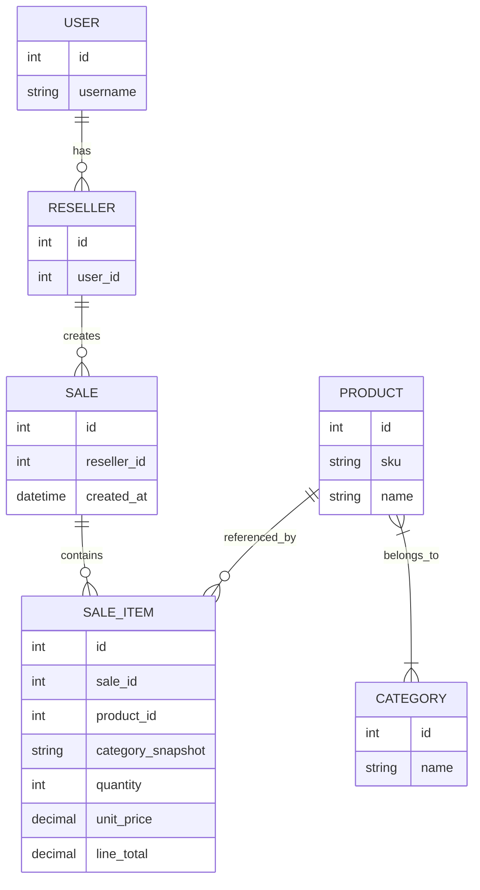

# Muito se diz que o grande vilão da sua API é o ORM — mas será que, muitas vezes, não é falta de otimização?

Muitos desenvolvedores culpam o ORM por tudo: porque “ORM é lento por natureza”, porque “as abstrações escondem consultas ineficientes” ou porque “só escala com SQL manual”, e essas queixas têm partes de verdade. O ORM adiciona camadas de abstração que, dependendo do design e da linguagem escolhida, podem introduzir gargalos; em projetos com domínios complexos ou quando a linguagem tem custo de execução mais alto, esses efeitos se amplificam e se tornam visíveis em produção. Ainda assim, antes de apontar o dedo para a biblioteca, vale checar o que de fato está acontecendo: consultas desnecessárias (N+1), carregamento de colunas inteiras quando só precisamos de algumas, transformação de grandes payloads em memória e falta de uso de recursos apropriados podem ser o verdadeiro vilão.

Para evidenciar isso, criei um exemplo com django no repositório [demo_orm](https://github.com/dmazoli/demo_orm) que compara duas abordagens de exportação CSV de vendas: uma versão intencionalmente não otimizada (N+1, monta tudo em memória) e outra otimizada (uso de `select_related`/`prefetch_related`, `values_list` e `StreamingHttpResponse`) — o objetivo é mostrar que, com pequenas mudanças de padrão, a diferença em consultas, tempo de resposta e uso de memória é substancial.

Temos aqui um cenário em que linguagem já não é conhecida por ser a mais performática, mas onde o ORM é amplamente usado e tem recursos de otimização disponíveis. O foco é mostrar que, mesmo com limitações inerentes, aplicar as otimizações corretas no ORM pode trazer ganhos relevantes e, muitas vezes, suficientes para o caso de uso.

Serão apresentados dois cenários para comparação: um dataset com cerca de 3.000 vendas e outro com cerca de 30.000 vendas, permitindo observar tanto comportamento em cargas médias quanto em cargas maiores.

## Estrutura do banco



### Dados do relatório (exemplo)

| Coluna no CSV | Origem (tabela.campo) | Observação (join necessário) |
|---|---|---|
| sale_id | `sale.id` | direto em `Sale` |
| sale_date | `sale.created_at` | direto em `Sale` |
| reseller_id | `reseller.id` | join `sale.reseller_id -> reseller.id` |
| reseller_username | `user.username` | join `reseller.user_id -> user.id` |
| product_id | `sale_item.product_id` | join `sale_item.product_id -> product.id` |
| product_name | `product.name` | join `product` |
| category_name | `category.name` ou `sale_item.category_snapshot` | pode vir do snapshot em `SaleItem` ou via join `product->category` |
| quantity | `sale_item.quantity` | direto em `SaleItem` |
| unit_price | `sale_item.unit_price` | direto em `SaleItem` |
| line_total | `sale_item.line_total` | direto em `SaleItem` |

Essas colunas evidenciam os joins típicos: `Sale -> Reseller -> User` para dados do revendedor, e `SaleItem -> Product -> Category` (ou leitura do snapshot `category` em `SaleItem`) para informações de produto/categoria.

## API não otimizada — análise e pontos de N+1

A implementação não otimizada expõe claramente onde ocorrem N+1s e quando as `QuerySet`s do Django são de fato avaliadas. Um pseudocódigo simplificado da rota não otimizada seria:

```python
@api_view(['GET'])
@renderer_classes([CSVRenderer])
def unoptimized_sales_report_csv(request: Request) -> HttpResponse:
 response = HttpResponse(content_type='text/csv; charset=utf-8')
 response['Content-Disposition'] = 'attachment; filename="unoptimized_sales_report.csv"'

 writer = csv.writer(response)
 writer.writerow([
  'sale_id',
  'sale_date',
  'reseller_username',
  'product_sku',
  'product_name',
  'item_category',
  'quantity',
  'unit_price',
  'line_total',
 ])

 sales = Sale.objects.all().order_by('id')
 # `sales` é um QuerySet preguiçoso até aqui; a query é executada ao iniciar a iteração abaixo
 for sale in sales:                              # ITERAÇÃO -> execução da query `Sale.objects.all()`
  reseller_username = sale.reseller.user.username
  # Acesso a `sale.reseller.user.username` dispara uma query por `sale` se não houver select_related

  for item in sale.items.all():              # CHAMADA por venda -> `sale.items.all()` executa uma query por `sale` (N+1)
   # Para cada `item`, acessos a relações podem disparar queries adicionais:
   product_sku = item.product.sku         # Acesso a `item.product` dispara query por item se não houver select_related
   product_name = item.product.name
   item_category = item.category.name    # Acesso a M2M/relacionamento de categoria pode disparar query

   row = [
    sale.id,
    sale.sold_at,
    reseller_username,
    product_sku,
    product_name,
    item_category,
    item.quantity,
    item.unit_price,
    item.line_total,
   ]
   writer.writerow([_serialize_csv_value(value) for value in row])

 # Montagem do CSV é feita diretamente no response (writer escreve no HttpResponse),
 # mas todas as linhas foram geradas após executar múltiplas queries por iteração.
 return response
```

Nos pontos marcados acima ocorrem N+1s clássicos: o acesso a `sale.reseller.user.username` dispara uma query por `sale` quando `select_related('reseller__user')` não foi usado; `sale.saleitem_set.all()` gera uma query por `sale` quando não há `prefetch_related('saleitem_set')`; para cada `SaleItem`, `item.product` dispara outra query por item, e a leitura de `product.categories` (relação muitos-para-muitos) tende a gerar mais queries por produto se não for pré-carregada.

Quanto à avaliação das `QuerySet`s: elas são "lazy" e só executam SQL quando passam pelo evaluate. As formas que avaliam um `QuerySet` mais comuns são: iteração (`for ... in qs`), conversão explícita para lista (`list(qs)`), indexação que acesse um elemento (`qs[0]`, que gera uma query com `LIMIT 1`), chamadas que materializam o resultado como `len(qs)` (que avalia o queryset e traz os objetos) e métodos que forçam execução/retornam agregados como `count()`, `exists()` ou `aggregate()` (note que `count()` normalmente dispara um `SELECT COUNT(*)` em vez de trazer objetos). Usar `bool(qs)` também força avaliação para determinar se há resultados. No exemplo acima, a iteração sobre `sales` executa a consulta principal; cada `sale.items.all()` é outro `QuerySet` que só executa quando iterado; e acessos a relações através de atributos (por exemplo, `item.product`) disparam queries adicionais enquanto não houver `select_related`/`prefetch_related` apropriado.

Além disso, a montagem do CSV em memória (`rows` completo em RAM) causa uso elevado de memória em datasets maiores — outro ponto crítico que não é culpa direta do ORM, mas sim do padrão de construção do relatório.

No código otimizado, essas consultas são reduzidas agrupando pré-carregamentos (`select_related('reseller__user')`, `prefetch_related('saleitem_set__product__categories')`), usando `values_list` para buscar apenas colunas necessárias e retornando o CSV via `StreamingHttpResponse` para evitar materializar todo o resultado em memória.

Imagens demonstrativas (não otimização):


## API otimizada — como os N+1 foram eliminados e onde as QuerySets são avaliadas

A versão otimizada aplica pré-carregamento e streaming para evitar consultas por iteração e materialização em memória. Um pseudocódigo da rota otimizada:

```python
@api_view(['GET'])
@renderer_classes([CSVRenderer])
def optimized_sales_report_stream_csv(request: Request) -> StreamingHttpResponse:
 pseudo_buffer = Echo()
 writer = csv.writer(pseudo_buffer)

 queryset = (
  SaleItem.objects.select_related(
   'sale',
   'sale__reseller',
   'sale__reseller__user',
   'product',
   'category',
  )
  .prefetch_related('product__categories')
  .values_list(
   'sale_id',
   'sale__sold_at',
   'sale__reseller__user__username',
   'product__sku',
   'product__name',
   'category__name',
   'quantity',
   'unit_price',
   'line_total',
  )
  .order_by('sale_id', 'id')
 )

 header = [
  'sale_id',
  'sale_date',
  'reseller_username',
  'product_sku',
  'product_name',
  'item_category',
  'quantity',
  'unit_price',
  'line_total',
 ]

 # `queryset` aqui é um QuerySet que retorna tuplas (por causa de values_list).
 # A execução da query acontece quando começamos a iterar sobre `queryset`.
 def row_generator():
  yield writer.writerow(header)
  for row in queryset.iterator(chunk_size=5000):
   # iterator() força a execução em chucks (evita materializar tudo em memória)
   yield writer.writerow([_serialize_csv_value(value) for value in row])

 response = StreamingHttpResponse(row_generator(), content_type='text/csv; charset=utf-8')
 response['Content-Disposition'] = 'attachment; filename="optimized_sales_report.csv"'
 return response
```

Pontos importantes de diferença em relação à versão não otimizada:

- `select_related('reseller__user')` transforma os acessos `sale.reseller.user` em JOINs na query inicial, evitando uma query por `sale` ao acessar o `username` do revendedor.
- `prefetch_related('saleitem_set')` executa uma query separada que traz todos os `SaleItem` relacionados às `Sale`s retornadas, evitando que `sale.saleitem_set.all()` seja executado por venda. Quando combinado com um `Prefetch` que usa `select_related('product')`, os `Product`s também são pré-carregados em lote.
- O uso de `.only(...)` ou `values_list(...)` limita colunas carregadas, reduzindo transferência de dados.
- `iterator(chunk_size=...)` evita que o Django materialize todo o resultado em memória de uma só vez; combinado com `StreamingHttpResponse`, o servidor transmite linhas conforme geradas.

Quanto à avaliação das `QuerySet`s na versão otimizada: a iteração sobre o `queryset` (por exemplo, via `for row in queryset.iterator(...)`) força a execução das consultas; quando há `prefetch_related`, o Django executa as queries adicionais necessárias no momento da avaliação para buscar os relacionamentos em lote e preenche o cache de relação dos objetos retornados, evitando queries por acessos posteriores. `select_related` traduz relacionamentos FK/OneToOne em JOINs na query principal, então os acessos a `sale.reseller` ou `sale.reseller.user` já estão disponíveis sem novas queries. `values_list` retorna tuplas e também dispara a execução quando iterado; `iterator()` serve para reduzir uso de memória durante a avaliação, consumindo resultados em blocos sem construir uma lista completa em RAM.

Com essa abordagem o número de queries se reduz drasticamente (tipicamente para 2–4 queries totas: uma para `Sale`+`select_related` JOINs e uma ou mais para os `prefetch_related`), o uso de memória é controlado e o tempo total por exportação cai significativamente.

Imagens demonstrativas (otimização):


## Resultados de performance (exemplo)

| Cenário       | 3k vendas | 30k vendas |
|---------------|-----------|------------|
| Não otimizado | 5,57s     | 1m 0,18s   |
| Otimizado     | 82ms      | 1,48s      |

Esses números ilustram o impacto prático: com a mesma base de código e pequenas mudanças no uso do ORM é possível reduzir latência e uso de recursos de forma substancial. Este exercício não tem a intenção de comparar tecnologias, mas sim de mostrar que, mesmo com limitações de linguagem ou abstração, aplicar as otimizações corretas normalmente traz ganhos relevantes e, muitas vezes, suficientes para o caso de uso.

Minha recomendação, portanto, é que antes de reescrever camadas ou abandonar o ORM, realize o profiling das queries, verifique planos de execução quando possível, meça uso de memória e latência e aplique as otimizações triviais de ORM.
